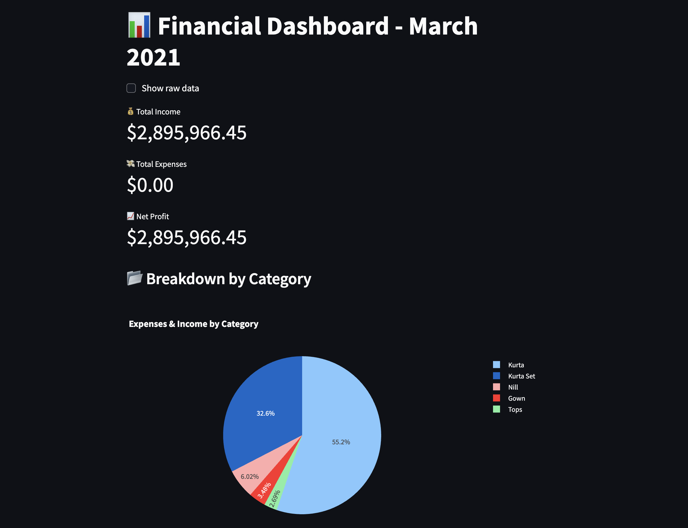

# Real-time-visualization-of-financial-data-with-Streamlit

A  interactive dashboard to explore and visualize profit & loss data.




## 🔧 Features
- Displays income, expenses, and net profit
- Pie chart by category
- Transaction filter
- Downloadable CSV export

## 🚀 How to Run

1. Clone the repo
```bash
git clone https://github.com/rushab0407/financial-dashboard-streamlit.git
cd financial-dashboard-streamlit
